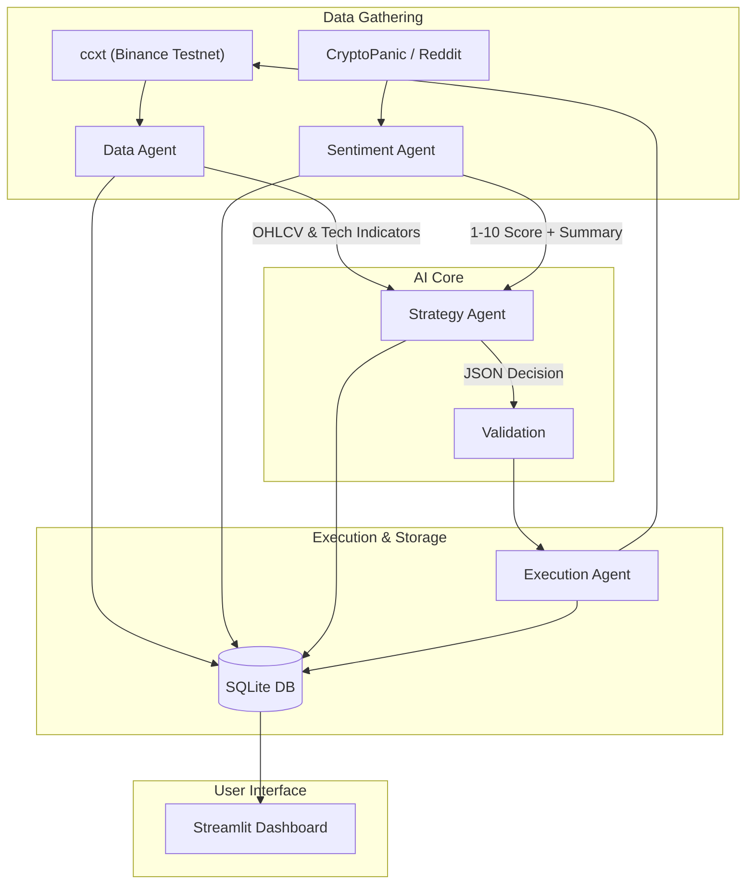
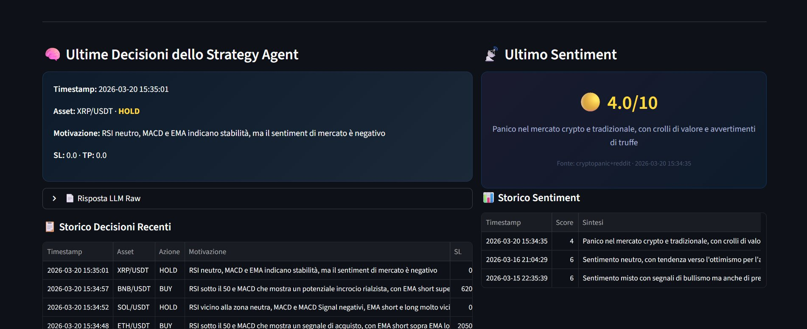

<div align="center">
  <h1>🤖 Multi-Agent Crypto Trading Bot</h1>
  <p>An AI-powered paper trading bot using LLaMA 3, Streamlit, and CCXT to analyze market data, evaluate sentiment, and execute trades on Binance Testnet.</p>
  
  
  
  
  
  
</div>

---

## 📖 Overview

This project is an advanced **Multi-Agent AI Crypto Trading Bot** built in Python. Instead of relying on traditional hardcoded algorithmic rules, it uses a multi-agent LLM reasoning pipeline (powered by **Groq** and **LLaMA 3**) to analyze technical indicators and global news sentiment. 

The bot operates entirely in **paper trading mode** on the Binance Testnet, ensuring zero financial risk while providing a realistic environment to backtest LLM-driven trading strategies.

## ✨ Features

- **🧠 Multi-Agent Architecture**: 
  - **Data Agent**: Fetches 15m OHLCV data via `ccxt` and computes Wilder's RSI, MACD, and EMA.
  - **Sentiment Agent**: Scrapes breaking news from CryptoPanic (fallback to Reddit `/r/CryptoCurrency`) and evaluates global market sentiment using `llama-3.1-8b-instant`.
  - **Strategy Agent**: Merges technical data and sentiment. Uses the powerful `llama-3.3-70b-versatile` model to output structural JSON decisions (`BUY`, `SELL`, `HOLD`).
  - **Execution Agent**: Validates safety constraints and executes trades on the Binance Testnet.
- **🛡️ Strict Risk Management**: Each trade uses a maximum of **2%** of the available portfolio. The Execution Agent enforces a hard safety check: no trade is placed without a valid **Stop Loss** and **Take Profit**.
- **📊 Real-Time Dashboard**: A responsive **Streamlit** UI reading offline from a local SQLite (WAL mode) database. It displays live portfolio metrics, interactive **Plotly Candlestick charts**, open positions, order history, and full transparency over the LLM reasoning logs.
- **⚙️ Asynchronous Orchestration**: Powered by **APScheduler**, managing concurrent 15-minute trading cycle loops and 2-hour sentiment gathering loops.

## 🏛️ Architecture


## 📸 Dashboard Preview




## 🚀 Setup Guide

### 1. Prerequisites
- Python 3.10+
- A [Binance Testnet](https://testnet.binance.vision/) account (API Key & Secret)
- A [Groq Console](https://console.groq.com/keys) API Key (Free)
- A [CryptoPanic](https://cryptopanic.com/developers/api/) API Key (Free)

### 2. Installation
Clone the repository and construct the project environment:
```bash
git clone https://github.com/ScapinelloTommaso/crypto-trading-bot.git
cd crypto-trading-bot
python -m venv venv
source venv/bin/activate  # On Windows: venv\Scripts\activate
pip install -r requirements.txt
```

### 3. Configuration
Copy the environment template and insert your API keys:
```bash
cp .env.example .env
```
Edit `.env` and fill in `GROQ_API_KEY`, `BINANCE_API_KEY`, `BINANCE_SECRET`, and `CRYPTOPANIC_API_KEY`.

### 4. Running the Bot
The system consists of two processes. The trading orchestrator and the UI dashboard. 

**Terminal 1 (The Orchestrator):**
```bash
python main.py
```

**Terminal 2 (The Dashboard):**
```bash
streamlit run dashboard/app.py
```
Open `http://localhost:8501` in your browser to view the live dashboard.

## ⚠️ Financial Disclaimer
**This project is for educational and portfolio demonstration purposes only.** It heavily relies on the Binance Testnet for paper trading. The AI models involved are non-deterministic and can hallucinate or assess the market incorrectly. **Do not connect this bot to a Live/Mainnet exchange account.** I am not responsible for any financial losses incurred from applying this software to real money trading.

---
```
Built with ❤️ tracking the crypto markets.
```
